- 下载vitepress模板 
- 创建自己的博客仓库
- 上传vitepress模板
- 配置工作流
- 设置Github Page
- 配置Gittalk
- 撰写文章
- 安全问题

## 1. 下载vitepress模板 

下载模板很简单，用过git版本控制工具

> 纪年小姐姐美化过的 [纪年小姐姐的博客](https://jexlau.github.io/blog/)  [纪年小姐姐的博客源码](https://github.com/JexLau/blog)
>

```sh
git clone https://github.com/JexLau/blog
```

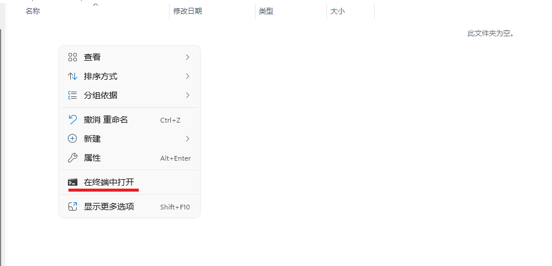

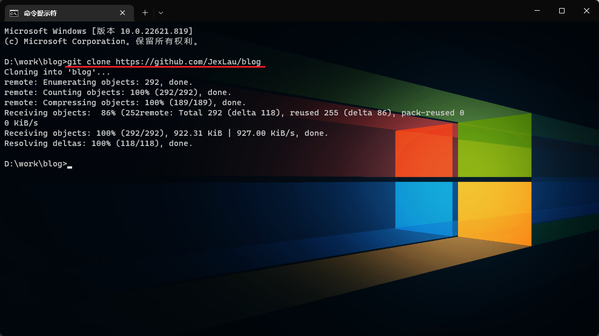

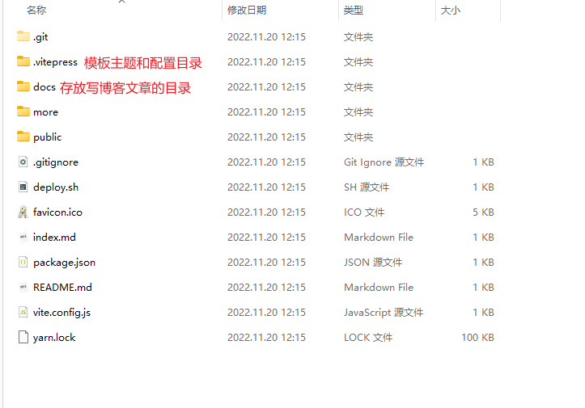

> 没有git版本控制工具的话，可以直接从github管网上下载模板源码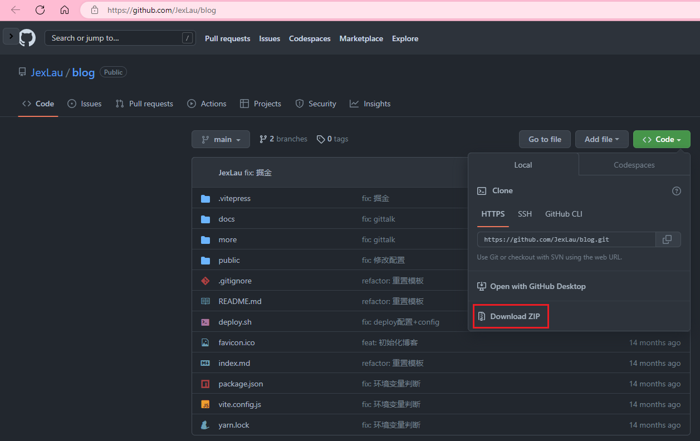

## 2. 创建自己的博客仓库

> 创建自己的博客仓库，仓库名可以自定义，比如 blog 啦，article 啦 ... 等都可以

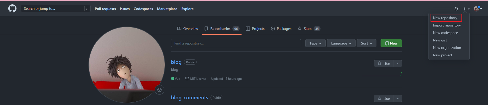

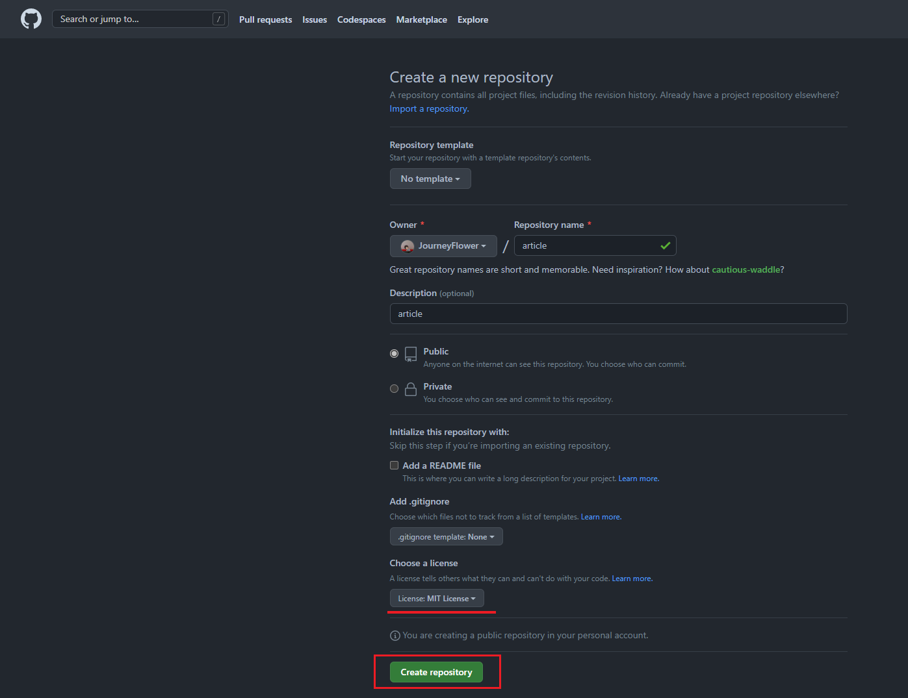

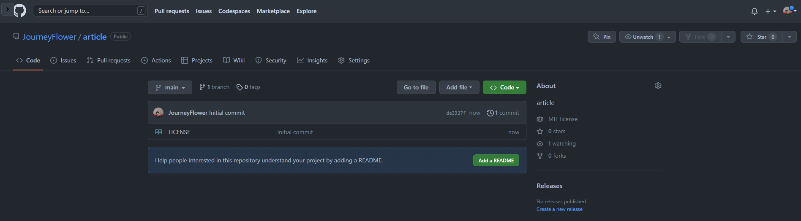

> [10月份开始GitHub把master换成main：这是开发者需要知道的几点_分支 ](https://www.sohu.com/a/421667057_185201)
>
> 另一项服务正从其技术剔除引起分歧的“master”术语。这回主角是GitHub，新的术语将由“master”改为“main”。这一变化的原因应该很明显，但此举是为了使这家公司摆脱任何提及奴隶制的印象，换成不会有误解的包容性术语。
>
> 技术界早该进行这种变化了，但至少终于有了实际行动。从2020年10月1日开始，所有“master分支”一律改名为“main分支”。

很明显，这又是为了满足西方资本家的口头Constitutional right

### 注意

这里创建的仓库默认只有这个`main分支`，我们`不要`觉得不习惯而去把她改成`master分支` 因为那样做，会使我们执行第4歩 `配置工作流`  失败

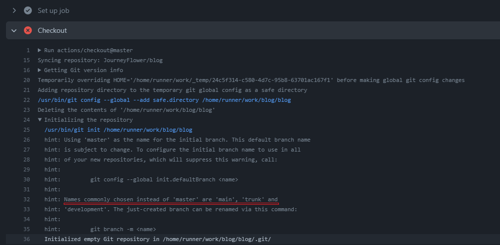

## 3. 上传vitepress模板

> 上传载模板很简单，同样利用git版本控制工具
>
> 暂时`先不急着改动`下载的`纪年小姐姐博客模板`，我们先用她的模板上传、搭建属于自己的github博客，后续再慢慢维护成自己

### 3.1第一步，删除从github上下载的源码里边的.git原始仓库信息

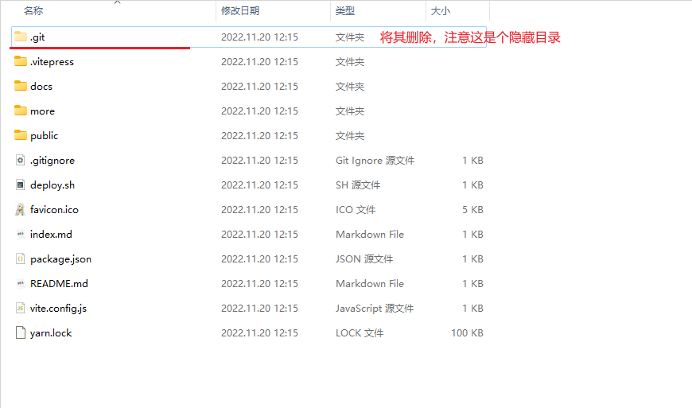

3.2在当前目录打开终端 使用 `git版本控制工具`执行以下命令上传到远端github仓库中

```sh
#从新初始化 当前目录 为本地git仓库
git init
#将目录中所有内容均 暂存到 本地git仓库 缓冲区
git add .
#将目录中所有内容均 提交到 本地git仓库
git commit -am "初始化我的博客"
#将 本地git仓库 仓库与已知 远程git仓库 关联
git remote add origin https://github.com/JourneyFlower/article.git
#允许在本地仓库与git仓库没有关连的情况下
#拉取 远程git仓库的main分支 到 本地git仓库 (即使两者本身没有关连的提交记录)
git pull origin main --allow-unrelated-histories
#将本git地仓库 推送到远程git仓库下的 main分支
git push origin HEAD:main
```

> #从新初始化 当前目录 为本地git仓库
> `git init`

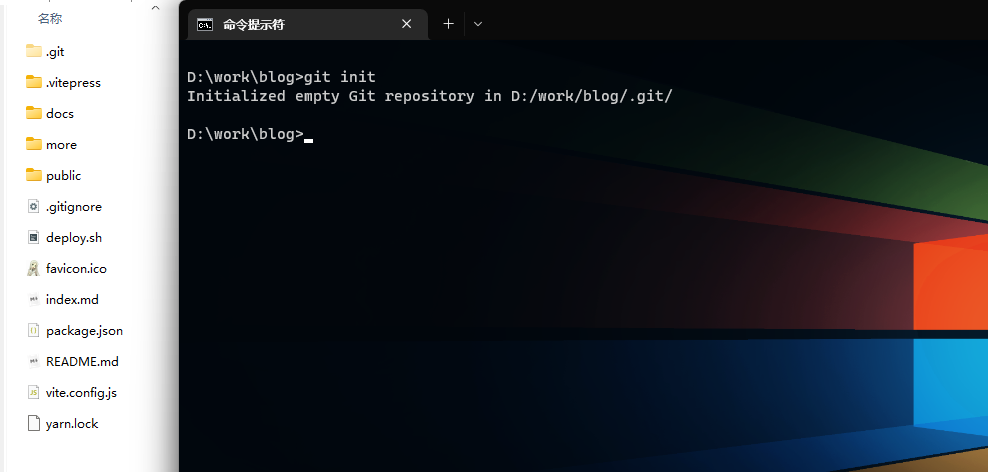

> #将目录中所有内容均 暂存到 本地git仓库 缓冲区
> `git add .`

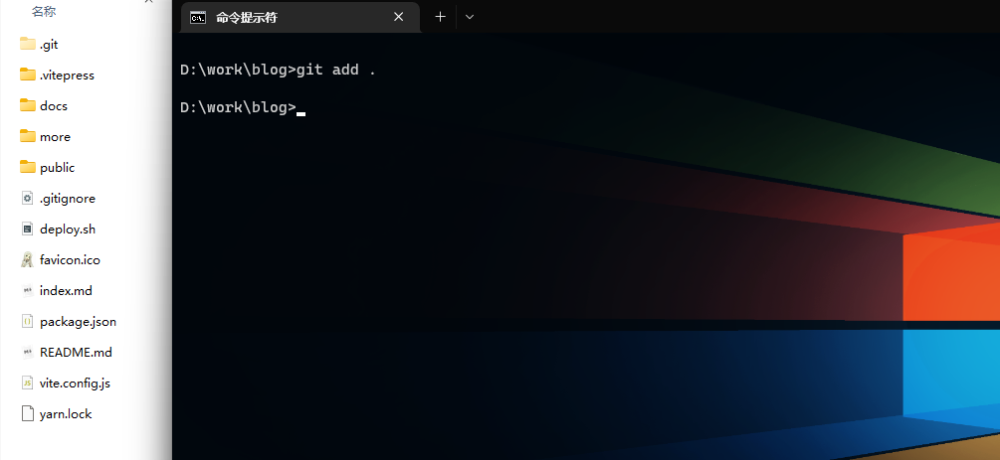

> #将目录中所有内容均 提交到 本地git仓库
> `git commit -am "初始化我的博客"`

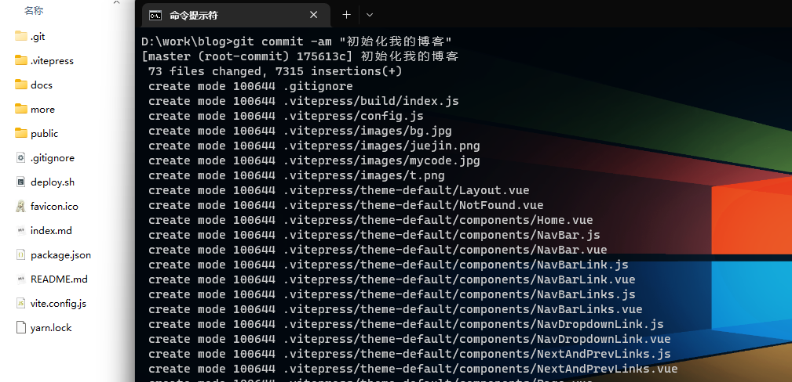

> #将 本地git仓库 仓库与已知 远程git仓库 关联
> `git remote add origin https://github.com/JourneyFlower/article.git`

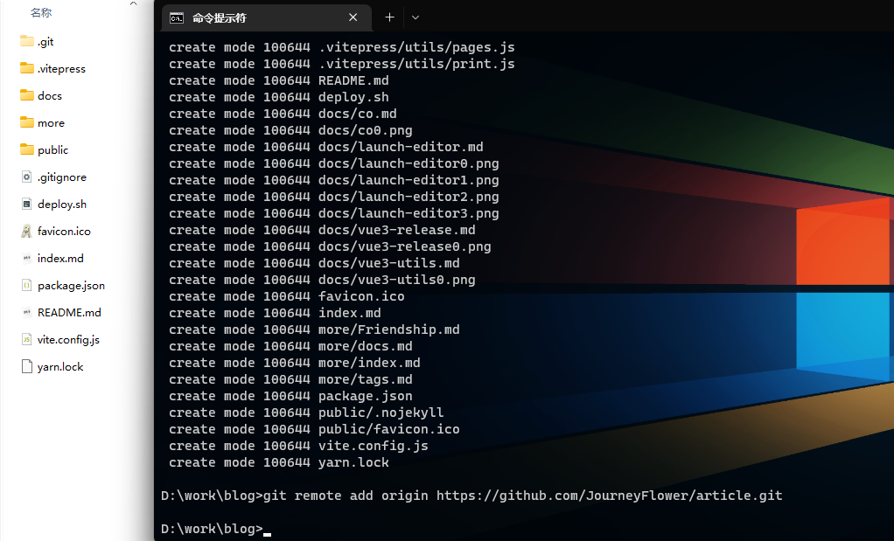

> #允许在本地仓库与git仓库没有关连的情况下
> #拉取 远程git仓库的main分支 到 本地git仓库 (即使两者本身没有关连的提交记录)
> `git pull origin main --allow-unrelated-histories`

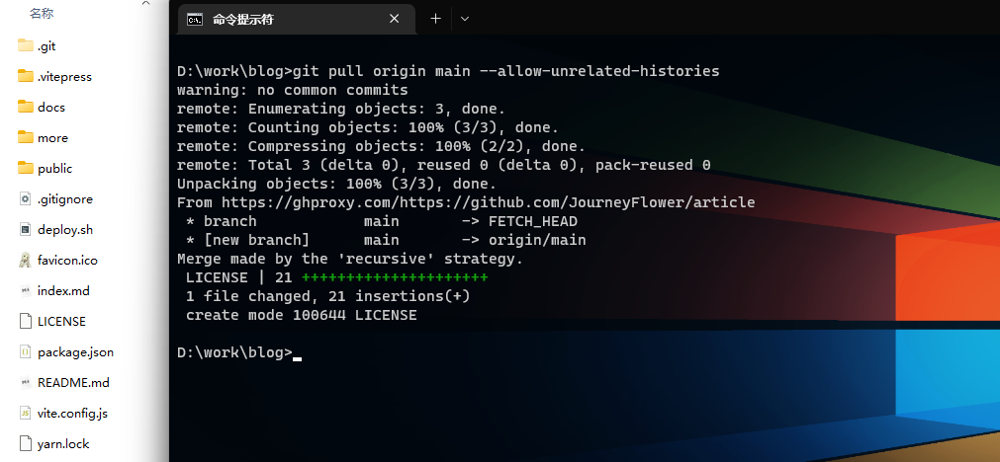

> #将本git地仓库 推送到远程git仓库下的 main分支
> `git push origin HEAD:main`

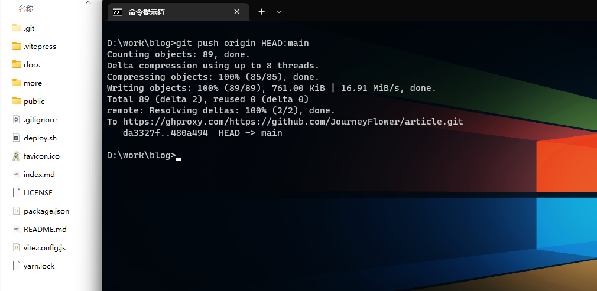

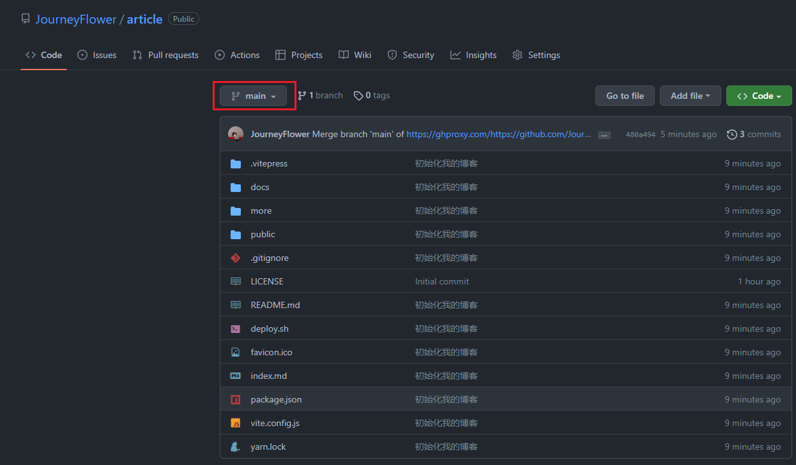

至次，我们把vitepress模板上传到了 github 上

如果我们自己电脑上没有 `git版本控制工具` 可自行安装，或者直接使用`github网页上的功能`上传博客源码

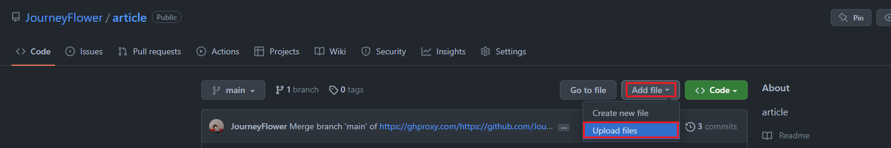

## 4.配置工作流

> github上的工作流文件，可以帮助我们将项目打包，就比如我们上传的 vitepress博客模板 也必须被编译打包为静态资源 才能被 Github-Page 所使用。
> 其实我们是可以在本地将我们下载好的源代码打包好，上传到 Github-Page 上使用的，这样我们每次变动都要在本地打好包，再上传到Github-Page使用。
> 但是没必要，github上的工作流可以在我们的博客每次修改和新增文章的时候帮我们打包好，我们就只管推送更改就可以了。省去我们自己打包的功夫，一次布署，长期受益，所以说拥有工作流多是一件美事啊~

### 4.1为我们对应的仓库创建工作流文件

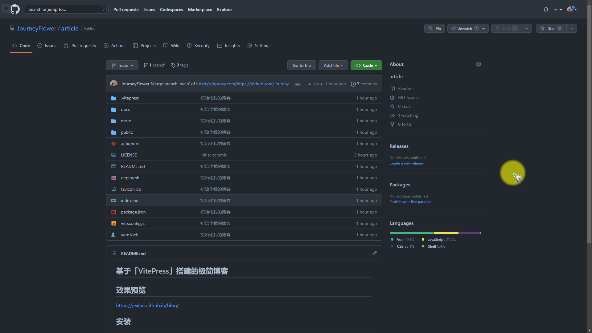

> 其中文件名随便填写，规范写法，我们写 Deploy 也就是我们在仓库内 建了  `.github/workflows/deploy.yml` 文件 格式是yaml
> 内容这里整理了

```yaml
#这里的名字就是deploy.yml(工作流)文件的名字 可自定义
name: Deploy
on:
  #配置当push main分支的时候执行
  push:
    branches:
      - main      
jobs:
  #工作流包含一个名为“build”的任务名称 可自定义
  build-and-deploy:
    #将会在最新版本的ubuntu系统上执行
    runs-on: ubuntu-latest
    strategy:
      matrix:
        node: ['lts/fermium']
    #具体的执行步骤
    steps:
      #检出main分支
      - name: Checkout
        uses: actions/checkout@main
        with:
          ref: 'main'
          persist-credentials: false
          fetch-depth: 0
        env:
          TZ: Asia/Shanghai
      #使用的node版本
      - name: Use Node.js ${{ matrix.node-version }}
        uses: actions/setup-node@main
        with:
          node-version:  ${{ matrix.node }}
      - name: Install dependencies
        #run: npm install
        run: yarn install
      # - name: npm audit fix
      #   run: npm audit fix       
      # - name: Use yarn create vlib
      #   run: yarn create vlib
      - name: Build My Blog
        # run: npm run build
        run: yarn run build
      - name: Deploy to Pages
        env:
         TZ: Asia/Shanghai
        #下面的 JourneyFlower 记得替换成自己的github帐号 
        #@github.com/JourneyFlower/article.git 也替换成自己的
        # secrets.GIT_EMAIL 是 工作流失败之后，需要通知的邮箱，换成自己的，一般写github账号邮箱
        # secrets.ACCESS_TOKEN 需要自己创建，应用访问token，工作流执行的时候需要
        run: |
         cd .vitepress/dist
         git config --global init.defaultBranch main
         git config --global --add safe.directory "*"
         git init
         git config user.name "JourneyFlower"
         git config user.email "${{ secrets.GIT_EMAIL }}"
         git add .
         git commit -m "Deploying to blog-pages from @ $GITHUB_SHA in $(date +"%Y年%m月%d日 %T %Z")"
         git push -f https://JourneyFlower:${{ secrets.ACCESS_TOKEN }}@github.com/JourneyFlower/article.git main:blog-pages
         cd - 
```

### 4.2注意

下面的 JourneyFlower 记得替换成自己的github帐号 
@github.com/JourneyFlower/article.git 也替换成自己的
secrets.GIT_EMAIL 是 工作流失败之后，需要通知的邮箱，换成自己的，一般写github账号邮箱
secrets.ACCESS_TOKEN 需要自己先创建，然后与GIT_EMAIL一同配置，工作流执行的时候需要

创建token

[New Personal Access Token (Classic)](https://github.com/settings/tokens/new)

按照下图填写，并勾选后，最后点击最下面的 绿色 Generate token 按钮就可以了。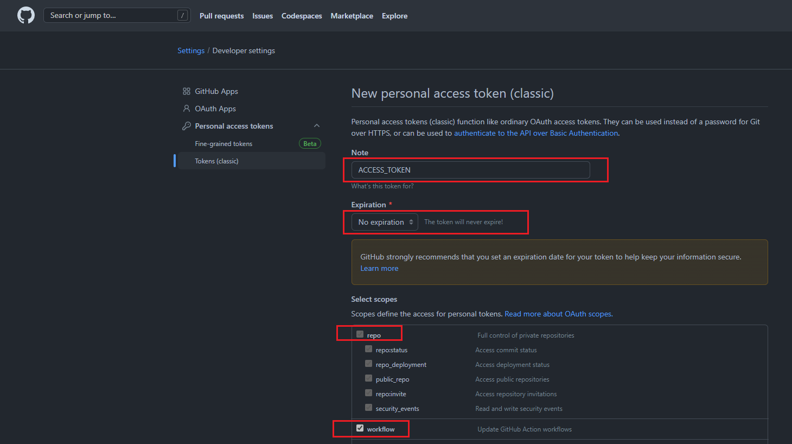

配置 `secrets.GIT_EMAIL` 和 `secrets.ACCESS_TOKEN`(这个在上图生成好后，会出现，可以直接复制一下)

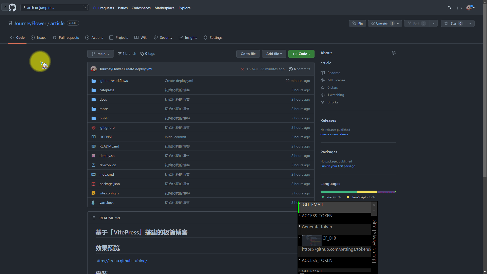

`ACCESS_TOKEN`我这里随便填写的，大家填 `ACCESS_TOKEN` 记得填写自己创建的那个 [Personal Access Tokens](https://github.com/settings/tokens)

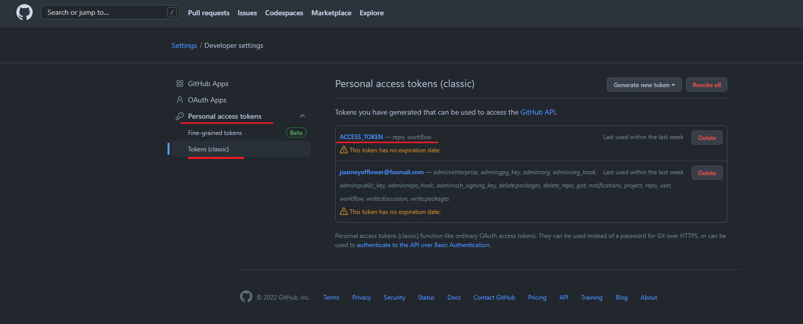

### 4.2提交文件

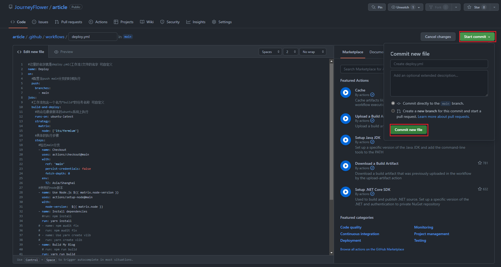

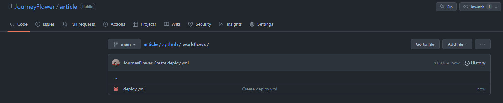

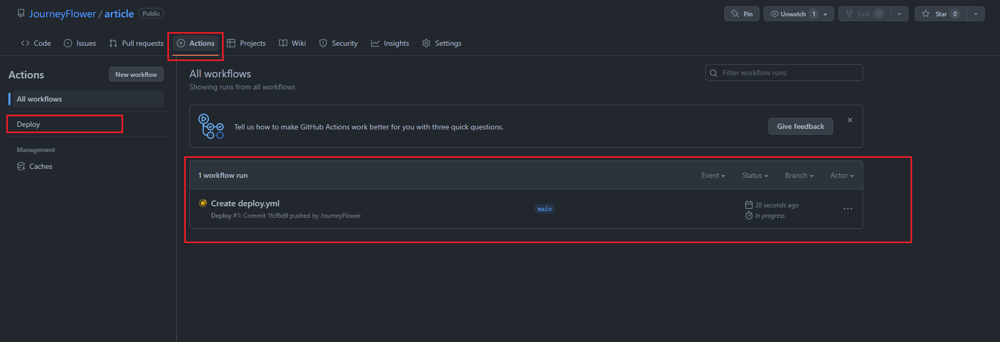

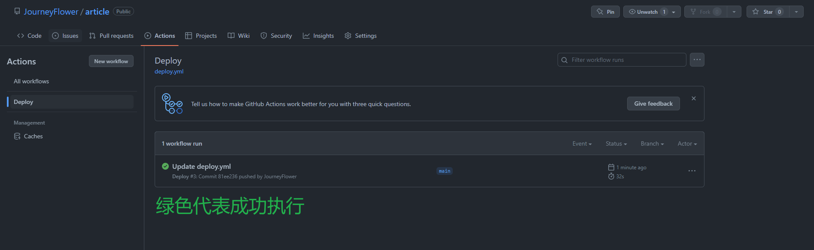

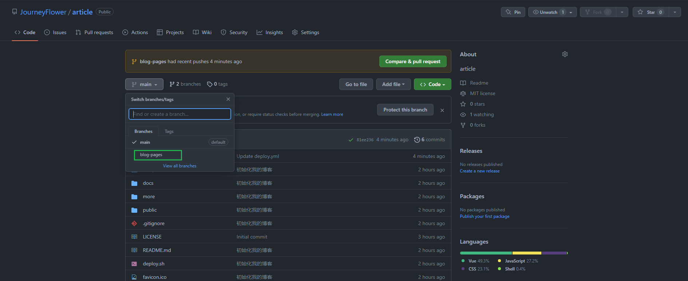

## 5. 设置Github Page

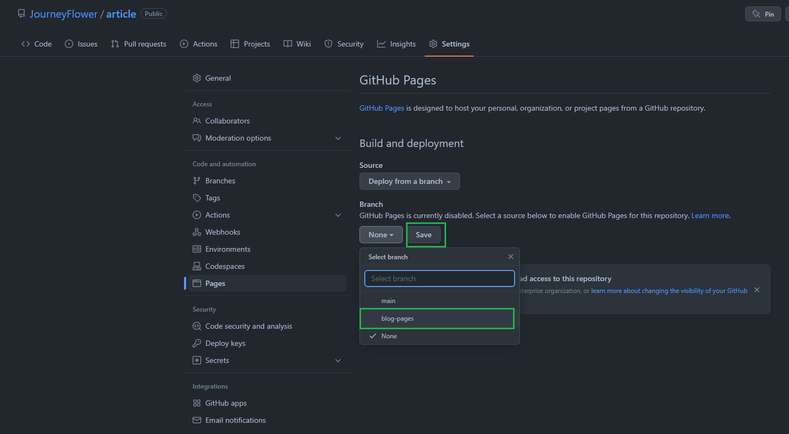

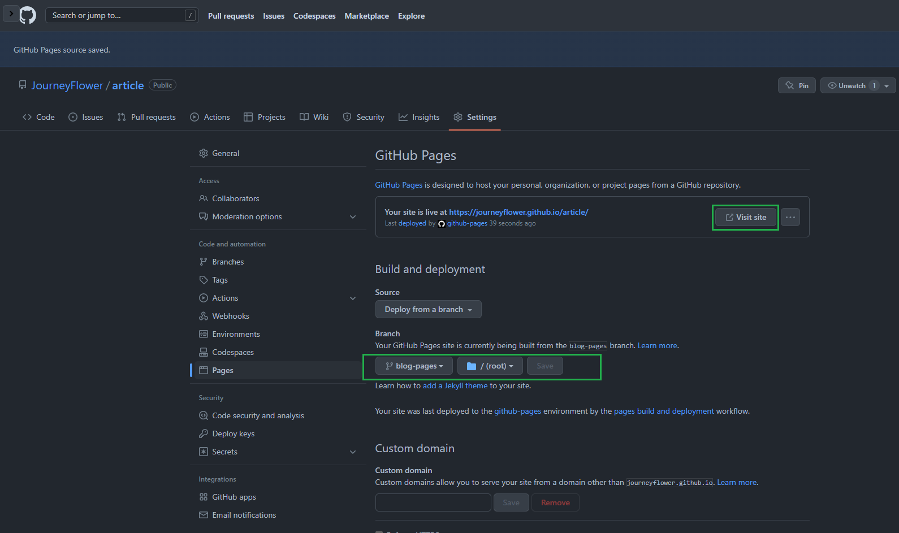

### 大功告成

## 6. 配置Gittalk

### 6.1建存放评论的仓库  blog-comments

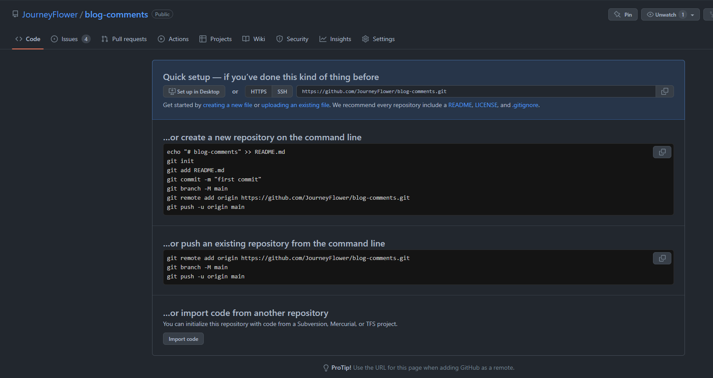

### 6.2创建`issues`设置标签初始化

以下这两个标签必须有

- Gittalk
- /blog/docs/co.html

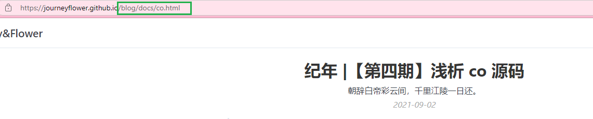

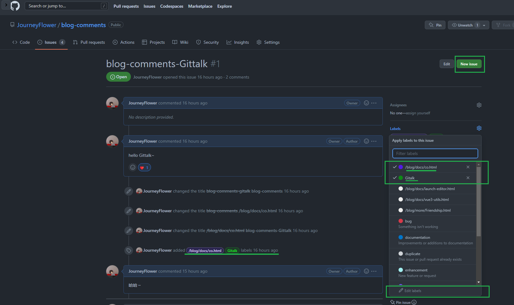


### 代码配置

```vue
<template>
  <div id="gitalk-container"></div>
</template>

<script>
export default {
  name: "blog-comments",
  mounted() {
    const commentConfig = {
      //https://github.com/settings/applications/new
      // 是否开启
      enable: true,
      // clientID
      clientID: "aaaaaaaaaaaa",
      // clientSecret
      clientSecret: "aaaaaaaaaaaaaaaaSecret",
      // 评论项目名
      repo: 'blog-comments',
      owner: 'JourneyFlower',
      admin: ['JourneyFlower'],
      //githubID: 'JourneyFlower',
      id: decodeURI(window.location.pathname),
      proxy: 'https://cors-anywhere.azm.workers.dev/https://github.com/login/oauth/access_token',//避免跨域
      language: 'zh-CN',
      distractionFreeMode: true
    };
    const gitalk = new Gitalk(commentConfig);
    gitalk.render("gitalk-container");
  },
};
</script>
```

> 上面配置的 clientID 和 clientSecret 申请地址
> https://github.com/settings/applications/new
>
> 这一句也很重要，不配置可能导致 Gittalk 加载网络错误
> proxy: 'https://cors-anywhere.azm.workers.dev/https://github.com/login/oauth/access_token',//避免跨域
>
> 仓库名
> repo: 'blog-comments',
> 仓库所有者信息
> owner: 'JourneyFlower',
> 可维护仓库的人,可以填多个，以数组的形式
> admin: ['JourneyFlower'],


## 7.安全

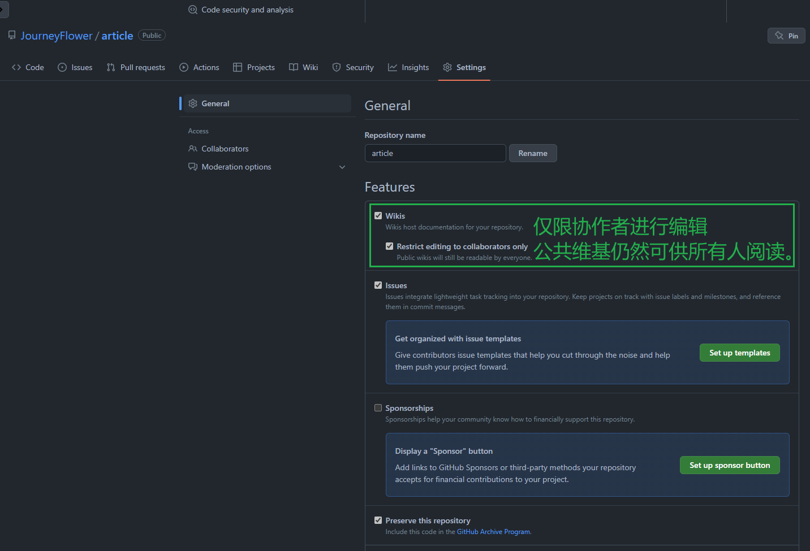

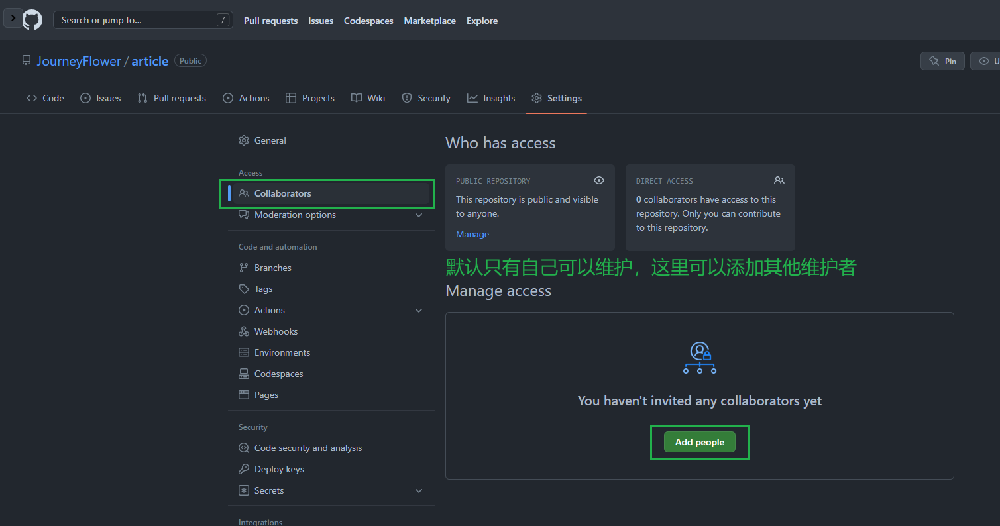

## 8. 感想

为了把把这个博客搭好，花了一天时间，写搭建心得花一天，这个周末也太充实流叭~

## 9.特别感谢

[瘦虎小哥哥](https://juejin.cn/post/7035473521480302629)

[纪年小姐姐](https://jexlau.github.io/blog/)

<audio src="./REOL404notfound.mp3"></audio>

<Comment/>
